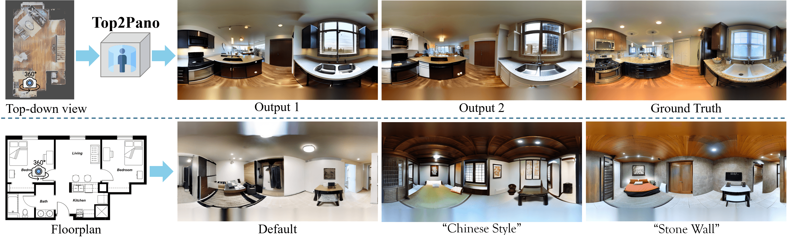

# Top2Pano: Learning to Generate Indoor Panoramas from Top-Down View



# Environment setup and downloading the pretrained model

## Step 1. Create a conda environment

    conda env create -f environment.yaml
    conda activate top2pano

## Step 2. Downloading the pretrained model
Please follow the <a href="https://github.com/lllyasviel/ControlNet" target="_blank" rel="noopener noreferrer">ControlNet</a> instructions, download the pretrained model, and place it in the <code>models</code> folder.

# Training model

    python main.py

You can replace the dataset file to run the Gibson or Matterport dataset.

# Inference with checkpoint

    python test.py

You can replace the dataset file to test on the Gibson or Matterport dataset.


# Generate panoramas on the floor plan

    python test_floorplan.py


# Prepare the Dataset


## Dataset Preparation and Rendering

Before rendering, you must run the import preparation scripts inside the `dataset_prep` folder to organize and preprocess your data. 
> Check expected dataset structure to pass the correct paths to the scripts.

### 1. Prepare the Dataset

#### Gibson Dataset

Run the following command to generate the config JSON for Gibson scenes:

```bash
python import_prep_gibson.py --glb_location_directory <path_to_gibson_glb_folder> --csv_location_directory <path_to_gibson_csv_folder> --csv_location_directory_2 <alternate_csv_folder>
```

- `--glb_location_directory`: Folder containing all `.glb` files (e.g., `gibson_glb/`).
- `--csv_location_directory`: Folder containing Gibson data and camera CSVs (e.g., `csv_location/`).
- `--csv_location_directory_2`: Alternate CSV folder (optional).

#### Matterport Dataset

Run the following command to process Matterport scenes:

```bash
python import_prep_matterport.py
```

- Edit the script to set `scans_path` to your Matterport scans directory if needed.

---

### 2. Render the Dataset with Blender Scripts

After preparing the data, use the Blender scripts (with prefix `bscript_`) to render the actual dataset. These scripts should be run inside Blender using the command line.

#### Gibson Rendering

```bash
blender --background --python bscript_gibson.py -- \
    --glb_loc <path_to_gibson_glb_folder> \
    --csv_loc <path_to_gibson_csv_folder> \
    --config_loc <path_to_generated_config_json> \
    --output_loc <output_folder>
```

- `--glb_loc`: Path to `.glb` files.
- `--csv_loc`: Path to camera CSVs.
- `--config_loc`: Path to config JSON generated by `import_prep_gibson.py`.
- `--output_loc`: Output folder for rendered data.

#### Matterport Rendering

```bash
blender --background --python bscript_matterport.py -- \
    --obj_loc <path_to_matterport_scans_folder> \
    --pano_loc <path_to_panorama_indoor_folder> \
    --render_size <image_size> \
    --athres <area_threshold> \
    --output_loc <output_folder>
```

- `--obj_loc`: Folder containing Matterport scene folders (e.g., `scans/`).
- `--pano_loc`: Folder containing indoor panoramas (e.g., `panorama (indoor)/`).
- `--render_size`: Render image size (default: 1024).
- `--athres`: Area threshold to filter large scenes (default: 2000).
- `--output_loc`: Output folder for rendered data.

**Note:** Make sure to adjust the paths and arguments according to your dataset locations. Always run the import prep scripts first to generate the necessary config files before running the Blender scripts.

---

## Expected Dataset Structure

```
/path/to/your/dataset/
├── gibson_glb/
│   ├── scene_name_1.glb
│   ├── scene_name_2.glb
│   └── ...
└── csv_location/
    ├── scene_name_1/
    │   ├── camera_poses.csv
    │   └── pano/
    │       ├── mist/
    │       ├── rgb/
    │       └── point/
    ├── scene_name_2/
    │   ├── camera_poses.csv
    │   └── pano/
    │       ├── mist/
    │       ├── rgb/
    │       └── point/
    └── ...
```

-   **`gibson_glb/`**: This directory should contain all the Gibson scene files in `.glb` format.
-   **`csv_location/`**: This directory contains subdirectories for each scene.
    -   Each scene subdirectory (e.g., `scene_name_1/`) holds the `camera_poses.csv` file and a `pano` directory.
    -   The `pano` directory is further divided into `mist`, `rgb`, and `point` subfolders for the panoramic data.

The expected dataset structure for the Matterport dataset is as follows:

```
/path/to/your/dataset/
├── scans/
│   ├── scene_name_1/
│   │   ├── matterport_mesh/
│   │   │   └── scene_name_1/
│   │   │       └── matterport_mesh/
│   │   │           └── ... (mesh data files)
│   │   ├── matterport_camera_poses/
│   │   │   └── scene_name_1/
│   │   │       └── matterport_camera_poses/
│   │   │           └── ... (camera pose files)
│   │   └── ...
│   ├── scene_name_2/
│   │   └── ...
│   └── ...
└── panorama (indoor)/
        ├── scene_name_1/
        │   ├── id_1_pano.jpg
        │   ├── id_2_pano.jpg
        │   └── ...
        ├── scene_name_2/
        │   └── ...
        └── ...
```

-   **`scans/`**: This is the root directory for all Matterport scene data, including meshes and camera poses.
    -   Each scene subdirectory (e.g., `scene_name_1/`) contains folders for different data types.
    -   The path structure includes a redundant nesting of the scene name and data type. For example, the mesh data for `scene_name_1` is located at `scans/scene_name_1/matterport_mesh/scene_name_1/matterport_mesh/`. 
    >   We will post an update in the future with better folder structure.
-   **`panorama (indoor)/`**: This directory contains the RGB panorama images.
    -   Each scene subdirectory (e.g., `scene_name_1/`) contains the corresponding panorama images in `.jpg` format (e.g., `0b302846f0994ec9851862b1d317d7f2_pano.jpg`).


# Acknowledgements

This project builds upon several excellent open source projects:

* [ControlNet](https://github.com/lllyasviel/ControlNet) - A neural network structure that adds spatial conditioning to diffusion models, enabling precise control over image generation with external guidance.  


* [Sat2Density](https://github.com/qianmingduowan/Sat2Density) - A geometric-based end-to-end framework for synthesizing ground-view panoramas from satellite imagery.

We thank the authors and contributors of these projects for their valuable contributions to the open-source community.


# Citation
```
@inproceedings{zhang2025top2pano,
  title     = {Top2Pano: Learning to Generate Indoor Panoramas from Top-Down View},
  author    = {Zitong Zhang and Suranjan Gautam and Rui Yu},
  booktitle = {Proceedings of the IEEE/CVF International Conference on Computer Vision (ICCV)},
  year      = {2025}
}
```


